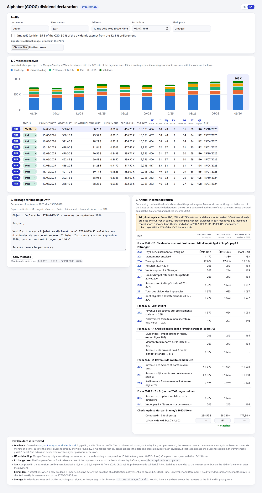

# dividendes-goog-fr

Chrome extension for French tax residents receiving Alphabet (GOOG) dividends
through Morgan Stanley at Work. It prepares the monthly **2778-DIV-SD**
declaration (prélèvement forfaitaire and prélèvements sociaux) and the boxes of
the annual **2047 / 2042** income tax return.



*Screenshot with made-up data.*

## What it does

- **Imports the dividends** when you open the Morgan Stanley at Work dashboard,
  logged in (see [How the import works](#how-the-import-works)).
- **Converts** each dividend at the ECB reference rate of its payment date.
- **Computes the tax** of each month: 12,8 %, CSG (9,2 %, 10,6 % from 2026),
  CRDS 0,5 %, solidarity levy 7,5 %, each rounded to the euro. Supports the
  impatriés regime (CGI 155 B: 50 % exempt from the 12,8 %, lines EA / 2DM).
- **Fills the official form**: the 2026 edition of the 2778-DIV-SD, with your
  signature image if provided, plus a page detailing the dividends.
- **Prepares the message** for the impots.gouv.fr secure messaging.
- **Tracks** each declaration (to file / sent / paid) and **reminds** you of
  new dividends and upcoming deadlines.
- **Lists the boxes of the annual return** for each year (2047 lines 202–273,
  cadre 7, 2042 2DC/2BH/2CK, 2042 C 8PL/8VL), with a check against the 1042-S.

Interface in French or English.

## How the import works

The extension only reads **your own data, in your own browser, while you are
logged in**, the way the Morgan Stanley at Work page itself does:

- When the dashboard loads, it requests your "past events" from Morgan
  Stanley. The extension observes that request and sends it again with earlier
  dates, to go back through the history, then keeps the dividends (date and
  gross amount in USD).
- If that fails, it reads the dividends shown in the dashboard's
  "Évènements passés" panel.
- It never reads, stores or sends your password, session or token. The
  dividends are stored in `chrome.storage.local` and never leave the browser.
- The only other network requests are to the European Central Bank (exchange
  rates) and to impots.gouv.fr (to detect a new edition of the form).

It relies on the current Morgan Stanley at Work site, in French; a redesign of
the site may break the import until the extension is updated.

## Install

1. `chrome://extensions` → enable **Developer mode** → **Load unpacked** →
   select the `extension/` folder.
2. Click the extension icon to open its page and fill in your profile.
3. Open the [Morgan Stanley at Work dashboard](https://atwork.morganstanley.com/solium/servlet/ui/dashboard)
   to import your dividends.

## Annual return: add, don't replace

**2DC, 2BH and 2CK are totals**: the Alphabet amounts shown by the extension
must be **added** to what your French banks have already pre-filled.

- **2BH** matters most: if the Alphabet dividends are missing from it, their
  social contributions, already paid through the 2778-DIV-SD declarations, are
  charged **a second time**. Online, add a line in 2BH with SIRET
  `11111111800019` and your name as collector, or fill line 272 of the 2047,
  but not both.
- **2CK** only takes the 12,8 % prélèvement (lines IL), not the social
  contributions.
- **8PL** is the gross amount, before the US tax (2047 line 208).

## Development

```sh
npm install
npm test          # Unit tests (Node 22).
npm run vendor    # Copy pdf-lib into extension/vendor/.
```

After changing the code, click the reload icon of the extension in
`chrome://extensions`.

## When a new form is published

The extension shows a banner when impots.gouv.fr publishes a new edition of
the 2778-DIV-SD. Then:

1. Download it into `extension/vendor/2778-div-sd.pdf`.
2. Update `BUNDLED_FORM_YEAR` in `extension/lib/form-version.js`.
3. Check the box positions at the top of `extension/lib/pdf.js`: render a
   generated PDF (`PDF_OUT=out.pdf npm test`, then `pdftoppm -png out.pdf`)
   and compare.
4. Check the rates in `extension/lib/tax.js` and the boxes of the annual
   return in `extension/app.js` against the new notices.

## Disclaimer

Personal tool, not tax advice. Check the amounts and the official notices
before filing.
